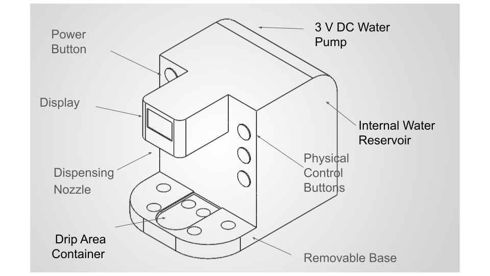

## Intro/overview

Fill-A-Bot is a liquid dispenser intended to help students, technicians, and other users measure and dispense liquid with less manual effort. A user will select an amount, place a container under the outlet, and start dispensing. The system is intended to measure the liquid delivered, show its progress, and stop when it reaches the selected amount. Our design also aims to reduce spills and make the device easy to use and clean.

## Generating Ideas

The following ideas explore different ways Fill-A-Bot could measure and dispense liquid, prevent spills, communicate with users, and make cleaning easier.

| Requirement / need | Feature | Detail |
| --- | --- | --- |
| Measure the amount dispensed | Scale beneath the cup | Measure the cup's weight before and during filling to estimate the amount added. |
| Measure the amount dispensed | Scale beneath the reservoir | Measure how much weight the reservoir loses during a pour. |
| Measure the amount dispensed | Inline flow sensor | Count sensor pulses as liquid passes through the tubing. |
| Measure the amount dispensed | Pump rotation sensor | Count pump revolutions and calibrate how much liquid each revolution delivers. |
| Measure the amount dispensed | Timed, calibrated pump | Run the pump for a calculated time based on measurements from test pours. |
| Deliver a selected amount | Peristaltic pump | Move liquid through tubing and stop the motor when the target is reached. |
| Deliver a selected amount | Diaphragm pump | Pump liquid from the reservoir to the cup under controller command. |
| Deliver a selected amount | Motor-driven syringe | Move a syringe plunger a calculated distance for each dispense. |
| Deliver a selected amount | Gravity-fed valve | Place the reservoir above the outlet and electronically open and close a valve. |
| Deliver a selected amount | Gear pump | Control a small pump's rotation to move liquid toward the outlet. |
| Prevent spills and unsafe operation | Infrared cup sensor | Allow dispensing only when a cup is detected beneath the nozzle. |
| Prevent spills and unsafe operation | Ultrasonic cup sensor | Check for a container below the outlet before starting. |
| Prevent spills and unsafe operation | Cup-presence check using the scale | Require a stable weight on the cup platform before dispensing. |
| Prevent spills and unsafe operation | Leak sensor in the base | Stop the pump if liquid reaches a drip area near the electronics. |
| Prevent spills and unsafe operation | Maximum run-time cutoff | Stop dispensing if it continues longer than a set safety limit. |
| Make operation and feedback clear | Buttons and LCD | Use buttons to set an amount and display the target and delivered amount. |
| Make operation and feedback clear | Rotary knob and OLED | Turn a knob to select an amount and press it to start. |
| Make operation and feedback clear | Numeric keypad | Let users type a specific amount before pressing Start. |
| Make operation and feedback clear | Preset amount buttons | Offer frequently used amounts with one button press each. |
| Make operation and feedback clear | Progress display and buzzer | Show filling progress and sound a brief alert when dispensing ends. |
| Make cleaning and refilling easy | Removable reservoir | Lift out the liquid container for refilling and washing. |
| Make cleaning and refilling easy | Replaceable pump tubing | Remove liquid-contact tubing for cleaning or replacement. |
| Make cleaning and refilling easy | Quick-disconnect tubing | Disconnect the liquid line without opening the electronics enclosure. |
| Make cleaning and refilling easy | Removable drip tray | Catch stray drops in a tray that can be taken out and washed. |
| Make cleaning and refilling easy | Accessible nozzle | Position the outlet so users can reach and wipe it after use. |
| Select different measurement units | Unit selection button | Let users cycle through supported units using a button on the device. |
| Select different measurement units | Unit selection switch | Use a physical switch to choose the unit before entering an amount. |
| Select different measurement units | Unit menu on the display | Let users choose a unit from a list shown on the screen. |
| Select different measurement units | Unit-labeled preset buttons | Provide preset amounts labeled with their units. |
| Select different measurement units | Saved unit preference | Start each new dispensing cycle with the unit the user selected last time. |
| Calibrate or zero the measurement system | Tare button | Set the reading to zero after an empty container is placed on the platform. |
| Calibrate or zero the measurement system | Guided calibration mode | Show instructions for checking the reading against a known amount. |
| Calibrate or zero the measurement system | Calibration weight setting | Let users enter the value of a known weight placed on the platform. |
| Calibrate or zero the measurement system | Empty-container check | Check that the measurement is stable before a dispensing cycle begins. |
| Calibrate or zero the measurement system | Calibration reminder | Prompt users to check calibration after a set number of dispensing cycles. |
| Fit different container sizes | Adjustable nozzle height | Move the outlet closer to the opening of short or tall containers. |
| Fit different container sizes | Sliding container platform | Move a container forward or backward to line it up with the outlet. |
| Fit different container sizes | Removable platform riser | Raise short containers closer to the nozzle. |
| Fit different container sizes | Adjustable side guides | Move guides inward or outward to help center different containers. |
| Fit different container sizes | Open-front dispensing area | Leave space in front of the outlet for wider containers. |
| Keep liquid away from electronics | Separate wet and dry compartments | Keep the tubing in a different section of the enclosure from the electronics. |
| Keep liquid away from electronics | Raised electronics mount | Position the circuit board above areas where leaked liquid could collect. |
| Keep liquid away from electronics | Sealed wire openings | Seal the places where wires pass into the electronics compartment. |
| Keep liquid away from electronics | Protective pump housing | Place a barrier around the pump connections to contain small leaks. |
| Keep liquid away from electronics | Sloped interior surface | Direct leaked liquid toward the front of the device and away from the circuit board. |
| Support repeated dispensing cycles | Automatic ready reset | Return to the Ready state after a completed pour without restarting the device. |
| Support repeated dispensing cycles | Last amount recall | Let users select the amount used in the previous pour. |
| Support repeated dispensing cycles | New-container prompt | Remind users to place an empty container before starting another pour. |
| Support repeated dispensing cycles | Cycle counter | Track how many pours the device has completed since startup. |
| Support repeated dispensing cycles | Pump cooldown indicator | Tell users when the pump is ready for another dispensing cycle. |
| Keep the device reliable | Startup sensor check | Check that the measurement sensor responds before allowing a pour. |
| Keep the device reliable | Watchdog timer | Reset the controller if the program stops responding. |
| Keep the device reliable | Secured wire connections | Use connectors that stay attached during repeated operation. |
| Keep the device reliable | Pump mounting bracket | Hold the pump firmly in place while it runs. |
| Keep the device reliable | Error state | Stop the pump and show an error if the measurement sensor stops giving usable readings. |
| Provide reliable power | Wall power adapter | Supply the device with the voltage and current its parts require. |
| Provide reliable power | Power switch | Let users turn the device fully off when it is not in use. |
| Provide reliable power | Replaceable fuse | Protect the electrical circuit if too much current flows. |
| Provide reliable power | Power indicator light | Show users when the device is receiving power. |
| Provide reliable power | Low-voltage detection | Stop a pour if the supply voltage drops too low for reliable operation. |
| Make operation accessible | Large Start button | Make the main control easy to locate and press. |
| Make operation accessible | Distinct Stop button | Use a different color and shape so users can find Stop quickly. |
| Make operation accessible | High-contrast control labels | Make the buttons easier to identify from a normal operating position. |
| Make operation accessible | Printed quick-start instructions | Put the basic operating steps on the device housing. |
| Make operation accessible | Adjustable display brightness | Let users make the screen easier to read in different lighting. |
| Reduce incomplete pours | Low-reservoir sensor | Detect when the liquid supply is too low to complete a pour. |
| Reduce incomplete pours | Prime button | Fill empty tubing with liquid before beginning a measured pour. |
| Reduce incomplete pours | Reservoir fill markings | Help users check whether enough liquid is available before starting. |
| Reduce incomplete pours | Minimum-amount setting | Prevent users from selecting an amount too small for the system to dispense accurately. |
| Reduce incomplete pours | Maximum-amount setting | Prevent users from requesting more liquid than the device can safely dispense in one cycle. |
| Make repairs easier | Standard-size tubing | Use tubing that can be replaced without ordering a custom part. |
| Make repairs easier | Screw-fastened enclosure | Allow the housing to be opened for service without damaging it. |
| Make repairs easier | Plug-in pump connection | Allow the pump to be disconnected and replaced without soldering. |
| Make repairs easier | Labeled internal wires | Identify connections so a team member can troubleshoot or replace a part. |
| Make repairs easier | Replaceable button assembly | Let users replace a worn control without replacing the entire device. |
| Allow emergency stopping | Emergency stop button | Immediately stop the pump when the user presses a dedicated safety button. |
| Allow emergency stopping | Pump power switch | Let the user directly turn off power to the pump if needed. |
| Allow emergency stopping | Cancel button | Let the user cancel a dispensing cycle before it is finished. |
| Monitor reservoir condition | Float level sensor | Detect when the liquid in the reservoir falls below a minimum level. |
| Monitor reservoir condition | Transparent reservoir | Let the user visually check how much liquid remains. |
| Monitor reservoir condition | Low-water warning | Display a warning when the reservoir is nearly empty. |
| Keep the device stable | Rubber feet | Prevent the dispenser from sliding across the work surface during use. |
| Keep the device stable | Weighted base | Place heavier components near the bottom to reduce the chance of tipping. |
| Keep the device stable | Wide base | Use a wider enclosure base to improve stability with different containers. |
| Reduce dripping and splashing | Pinch valve | Close the flexible tubing after dispensing to reduce dripping from the nozzle. |
| Reduce dripping and splashing | Splash guard | Place a removable barrier around the dispensing area to contain stray drops. |
| Reduce dripping and splashing | Narrow nozzle tip | Direct the liquid stream more accurately into smaller container openings. |
| Detect system problems | Sensor error message | Display an error when the measurement sensor gives an invalid reading. |
| Detect system problems | No-flow warning | Warn the user if the pump is running but the measured liquid amount is not increasing. |
| Detect system problems | Startup sensor check | Check that the measurement sensor is working before allowing dispensing. |
| Improve dispensing control | Two-speed pump control | Use a faster pump speed during filling and a slower speed near the target amount. |
| Improve dispensing control | Target approach slowdown | Reduce the pump speed as the measured amount approaches the selected amount. |
| Improve dispensing control | Small-volume mode | Use a slower pump speed when dispensing small amounts for better control. |
| Make the device accessible | Large control buttons | Make important controls easy to see and press. |
| Make the device accessible | High-contrast display | Make measurements and system messages easier to read. |
| Make the device accessible | Angled display mount | Position the display at an angle that is easy to see during normal use. |
| Make manufacturing easier | Two-piece enclosure | Use a simple base and cover that can be manufactured and assembled separately. |
| Make manufacturing easier | Standard screws | Use common screw sizes to simplify assembly and maintenance. |
| Reduce wasted liquid | Automatic tube priming | Fill empty tubing before starting the measured dispensing cycle. |
| Reduce wasted liquid | Reservoir fill markings | Let the user easily see approximately how much liquid is available. |

## Organizing Ideas

Add your context and tables

## Initial Design Concepts
Clays Cardboard Design

### Troy's Concept - Adjustable Modular Dispenser

This concept uses a compact vertical design inspired by a single-serve coffee machine. The main body contains the water reservoir, pump, and electronics. Water is pumped from the internal reservoir through a nozzle positioned above the container. A water-level sensor monitors the remaining water supply, while a front display and physical controls allow the user to operate the dispenser and view system information.

The design also uses removable sections to make the system easier to adjust and maintain. The removable base provides space for different container sizes and gives easier access to components for cleaning and maintenance. The overall design focuses on keeping the water-handling, mechanical, and electrical components organized within a compact enclosure.

## Design Process Documentation 

The team performed well when it came to coming up with product ideas. Nikita, Troy, and Clay came up with ideas for the features of our product. Not all these ideas for features had feasibility in mind but still gave the group later insight into what we might want to add later. This whole step was coordinated through in-person discussion and SMS messaging. Cole went through the list of 113 ideas and picked out 38 qualities that could work in a product the group could make in a markdown file. The whole group then got together over Discord to discuss how these qualities could be sorted. After some discussion, the group decided on 3 categories: electrical, user interaction, and mechanical. The group then went through the list Cole made and discussed each item whether it belonged in a specific category. Cole made separate markdown files for each category. After the sorting was finished, the group discussed what they would do for the 3 product models. It came to the agreement that Clay would make a cardboard model, and Cole would make the other two models based on the ideas and sketches of Nikita and Troy using Solidworks. Cole made the models once Nikita and Troy sent over their ideas and sketches over Discord. Cole then sent screenshots of the models he created over Discord for Nikita and Troy to annotate. Clay finished the cardboard model and took pictures of varying sides of the model. Each picture was annotated with the novel features he picked out of the ideated set. For this assignment each group member contributed to the best of their abilities and illustrated the importance of forming a solid foundation for developing a product. 

